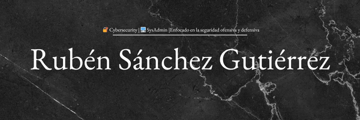

# 👨‍💻 Rubén Sánchez Gutiérrez

Administrador de Sistemas especializado en entornos Windows y Linux, con una clara vocación hacia la **Ciberseguridad**.

---

## 📌 Sobre mí

Soy un técnico en sistemas con formación en ASIR, experiencia en soporte remoto y presencial, y familiaridad con tareas de automatización. Me encuentro en continuo desarrollo con el objetivo de especializarme en ciberseguridad, tanto en su vertiente ofensiva (pentesting, CTF, pruebas de intrusión) como defensiva (protección de sistemas, respuesta ante incidentes, hardening).

---

## 🛠️ Habilidades Técnicas

- **Administración de Sistemas**: Windows Server, Linux, Active Directory, LDAP, UNIX Shell Scripting, PowerShell.
- **Redes y Virtualización**: Cisco, diseño y arquitectura de redes, configuración (DHCP, DNS, FTP, VPN, firewall).
- **Bases de Datos**: MySQL, SQL, diseño de esquemas.
- **Scripting y Programación**: Bash, PowerShell, HTML, CSS, Perl.
- **Ciberseguridad**: Gestión de firewalls, protección de sistemas, definición de políticas de seguridad, prácticas de pentesting.
- **Ofimática avanzada**: Microsoft Office (Excel y Word avanzado).

---

## 💼 Experiencia Profesional

### 🏢 Administrador de Sistemas (Prácticas)
**02/2025 – 05/2025 | Zamora, España**

- Soporte técnico remoto y presencial a usuarios.
- Gestión de usuarios y recursos compartidos.
- Resolución de incidencias técnicas en equipos y periféricos.
- Mantenimiento de hardware y entorno de usuario.

### 🏢 Informático (Prácticas)
**09/2022 – 12/2022 | Zamora, España**

- Generación de informes y uso avanzado de Word y Excel.
- Reparación y mantenimiento de equipos.
- Resolución de incidencias informáticas.

---

## 🎓 Formación Académica

- **Grado Superior** en Administración de Sistemas Informáticos en Red – IES Claudio Moyano  
- **Grado Medio** en Sistemas Microinformáticos y Redes – IES Claudio Moyano / IES Fernando Wirtz Suárez

---

## 🎯 Objetivo Profesional

Mi objetivo es crecer como profesional de TI con un enfoque claro hacia la **ciberseguridad ofensiva y defensiva**, participando en entornos de pruebas, despliegues simulados y análisis de incidentes. Actualmente estoy desarrollando un entorno CTF automatizado como proyecto de fin de grado.

---

## 📬 Contacto

- 📧 Email: [rubensgbusiness@gmail.com](mailto:rubensgbusiness@gmail.com)
- 💼 LinkedIn: [linkedin.com/in/rubénsánchezgutiérrez](https://www.linkedin.com/in/rubénsánchezgutiérrez)

---

