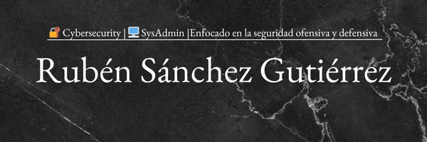

# 👨‍💻 Rubén Sánchez Gutiérrez

Administrador de Sistemas especializado en entornos Windows y Linux, con una clara vocación hacia la **Ciberseguridad**.

---

## 📌 Sobre mí

Especialista en ciberseguridad ofensiva y pentesting, con formación en Administración de Sistemas Informáticos en Red (ASIR) y experiencia práctica en pruebas de intrusión, explotación de vulnerabilidades y seguridad de entornos corporativos.
Actualmente cuento con la certificación eJPTv2 y me estoy preparando para eCPPTv3 y OSCP, consolidando conocimientos en técnicas avanzadas de pentesting.

---
## 📚 Conocimientos en Ciberseguridad

- **Reconocimiento y OSINT**:  
  Escaneo avanzado con Nmap (evasión de firewalls, scripts NSE, creación de scripts en Lua), técnicas de descubrimiento en red (ARP, ICMP), enumeración de subdominios, Google Hacking, fingerprinting de SO, obtención de credenciales y fugas de información.  

- **Enumeración de Servicios y CMS**:  
  Análisis y explotación inicial en FTP, SSH, SMB, HTTP/HTTPS, así como enumeración de gestores de contenido (WordPress, Joomla, Drupal, Magento).  

- **Explotación de Vulnerabilidades**:  
  Reverse/Bind shells, payloads staged y non-staged, explotación manual y automatizada, uso de BurpSuite, enumeración de sistemas comprometidos, **pivoting en entornos internos**.  

- **OWASP Top 10 y Vulnerabilidades Web Avanzadas**:  
  SQLi, XSS, XXE, LFI/RFI, CSRF, SSRF, SSTI, IDOR, ataques en JWT y GraphQL, deserialización, NoSQLi, LDAPi, Prototype Pollution, ShellShock, CORS, Mass Assignment, Open Redirect, entre otros.  

- **Escalada de Privilegios en Linux**:  
  Abuso de sudoers, SUID, cronjobs, PATH Hijacking, Python Library Hijacking, capabilities, exploits de kernel, servicios internos, Docker breakout y secuestro de librerías compartidas.  

- **Explotación de Active Directory**:  
  Conocimientos prácticos en técnicas como **Kerberoasting, AS-REP Roasting, Overpass-the-Hash, Pass-the-Ticket, Golden Ticket, Silver Ticket, DCSync, Skeleton Key, Ticket Harvesting**.  

- **Explotación Binaria (Buffer Overflow)**:  
  Creación de laboratorio en Windows con Immunity Debugger, fuzzing y control de EIP, badchars, búsqueda de opcodes, ejecución de shellcode, explotación manual de binarios, creación y modificación de shellcodes.  

- **Reporting y Documentación**:  
  Elaboración de informes técnicos y profesionales en **LaTeX**, siguiendo la estructura de un reporte de pentesting.  

---

## 🛠️ Habilidades Técnicas

- **Administración de Sistemas**: Windows Server, Linux, Active Directory, LDAP, UNIX Shell Scripting, PowerShell.
- **Redes y Virtualización**: Cisco, diseño y arquitectura de redes, configuración (DHCP, DNS, FTP, VPN, firewall).
- **Bases de Datos**: MySQL, SQL, diseño de esquemas.
- **Scripting y Programación**: Bash, PowerShell, HTML, CSS, Perl.
- **Ciberseguridad**: Gestión de firewalls, protección de sistemas, definición de políticas de seguridad, prácticas de pentesting.
- **Ofimática avanzada**: Microsoft Office (Excel y Word avanzado).

---

## 💼 Experiencia Profesional

### 🏢 SysAdmin  
**07/2025 – 08/2025 | AracnoSoft S.L. | La Coruña, España**

- Montaje, configuración y gestión de servidores.  
- Administración y soporte de redes corporativas con **Panda Cytomic**.  
- Implementación y gestión de **VPNs**.  
- Soporte técnico y resolución de incidencias a nivel de infraestructura.  
- Gestión de servicios de red y seguridad perimetral. 

### 🏢 Administrador de Sistemas (Prácticas)
**02/2025 – 05/2025 | Zamora, España**

- Soporte técnico remoto y presencial a usuarios.
- Gestión de usuarios y recursos compartidos.
- Resolución de incidencias técnicas en equipos y periféricos.
- Mantenimiento de hardware y entorno de usuario.

### 🏢 Informático (Prácticas)
**09/2022 – 12/2022 | Zamora, España**

- Generación de informes y uso avanzado de Word y Excel.
- Reparación y mantenimiento de equipos.
- Resolución de incidencias informáticas.

---

## 🎓 Formación Académica

- **Grado Superior** en Administración de Sistemas Informáticos en Red – IES Claudio Moyano  
- **Grado Medio** en Sistemas Microinformáticos y Redes – IES Claudio Moyano / IES Fernando Wirtz Suárez

---

## 📬 Contacto

- 📧 Email: [rubensgbusiness@gmail.com](mailto:rubensgbusiness@gmail.com)
- 💼 LinkedIn: [linkedin.com/in/rubénsánchezgutiérrez](https://www.linkedin.com/in/rubénsánchezgutiérrez)

---

